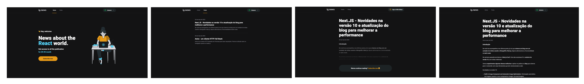

<h1 align="center">
  Via cep
</h1>

<h5 align="center">
  Projeto feito utilizando NextJs, Stripe e Prismic
</h5>

## :rocket: Como executar

<ul>
  <li>Clonar o projeto</li>
  <li>Entrar pasta na raiz e executar o comando <strong>yarn</strong></li>
  <li>Executar o projeto com o comando <strong>yarn dev</strong></li>
</ul>

## ⌨️ Tecnologias

<ul>
  <li>NextJs</li>
  <li>Stripe</li>
  <li>Prismic</li>
  <li>TypeScript</li>
</ul>
